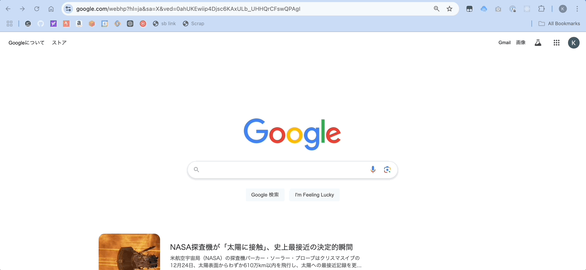
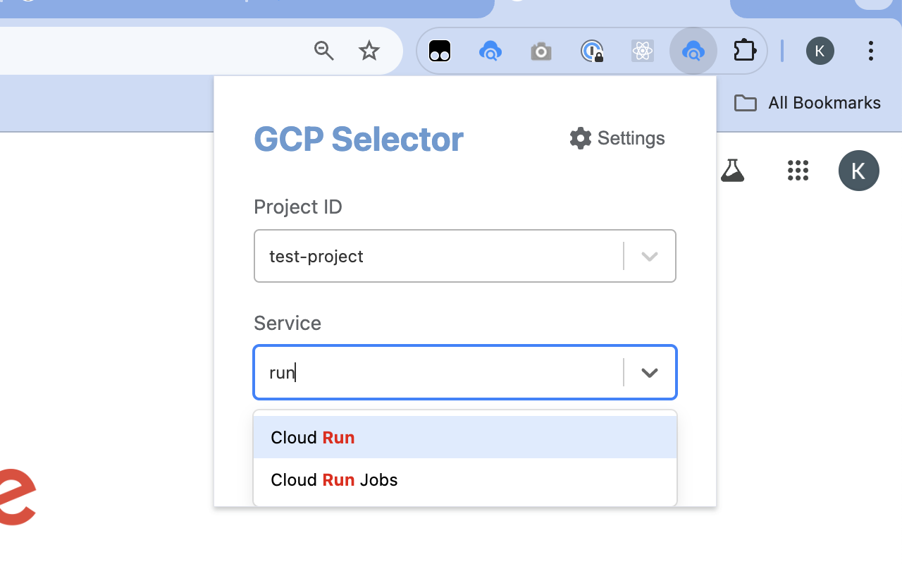
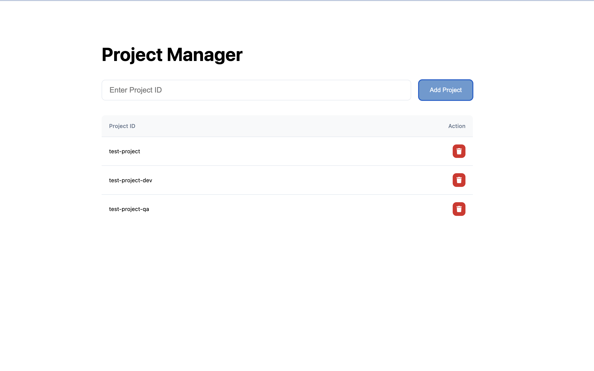

# gcp-selector

A Chrome extension that allows you to quickly select Google Cloud Platform (GCP) projects and services at once.



The list supports fuzzy search, with matching characters highlighted in red for easy identification.




## Project Structure

### Architecture
This project is a Chrome extension built with React + TypeScript.

### Directory Structure
```
├── manifest.json          # Chrome extension manifest
├── package.json           # Project dependencies
├── tsconfig.json          # TypeScript configuration
├── webpack.config.js      # Webpack configuration
├── jest.config.js         # Test configuration
│
├── src/                   # Source code
│   ├── popup/             # Popup screen
│   │   ├── Popup.tsx      # Main popup component
│   │   ├── popup.html     # Popup HTML
│   │   └── index.tsx      # Popup entry point
│   │
│   ├── option/            # Settings screen
│   │   ├── Option.tsx     # Settings component
│   │   ├── option.html    # Settings HTML
│   │   └── index.tsx      # Settings entry point
│   │
│   ├── components/        # Reusable components
│   │   ├── popup/         # Popup-specific components
│   │   │   ├── PopupHeader.tsx        # Header component
│   │   │   ├── ProjectSelector.tsx    # Project selection component
│   │   │   ├── ServiceSelector.tsx    # Service selection component
│   │   │   └── NoProjectsMessage.tsx  # No projects message
│   │   └── select/        # Select-related components
│   │       └── Option.tsx # Custom option component
│   │
│   ├── hooks/             # Custom hooks
│   │   ├── useNavigation.ts  # Navigation management
│   │   ├── useOptions.ts     # Settings management
│   │   └── useProjects.ts    # Project management
│   │
│   ├── utils/             # Utility functions
│   │   ├── projects/      # Project-related utilities
│   │   │   ├── AddProject.ts     # Add project
│   │   │   ├── DeleteProject.ts  # Delete project
│   │   │   ├── ListProject.ts    # List projects
│   │   │   └── Constant.ts       # Constants
│   │   └── services/      # Service-related utilities
│   │       └── ListServices.ts   # List services
│   │
│   └── types/             # Type definitions
│       ├── SelectOption.ts    # Select option types
│       └── Service.ts         # Service types
│
├── public/                # Public assets
├── dist/                  # Build output
├── icons/                 # Icon files
└── image/                 # Documentation images
```

### Technology Stack
- **Framework**: React 19.0.0
- **Language**: TypeScript
- **UI**: react-select, FontAwesome
- **Build Tool**: Webpack
- **Testing**: Jest, React Testing Library
- **Package Manager**: npm

### Key Features
- Simultaneous GCP project and service selection
- Fuzzy search support
- Seamless Chrome extension integration
- Local storage for project management

## Features
- Select both project and service simultaneously
- Register your GCP project IDs

## Installation

Install easily from the [Chrome Web Store](https://chrome.google.com/webstore/detail/gcp-selector/gdfiojnnhlfmkbghihllimpaanldflag)

## Settings



## Requirements
- Google Chrome browser
- Account with access to GCP console
