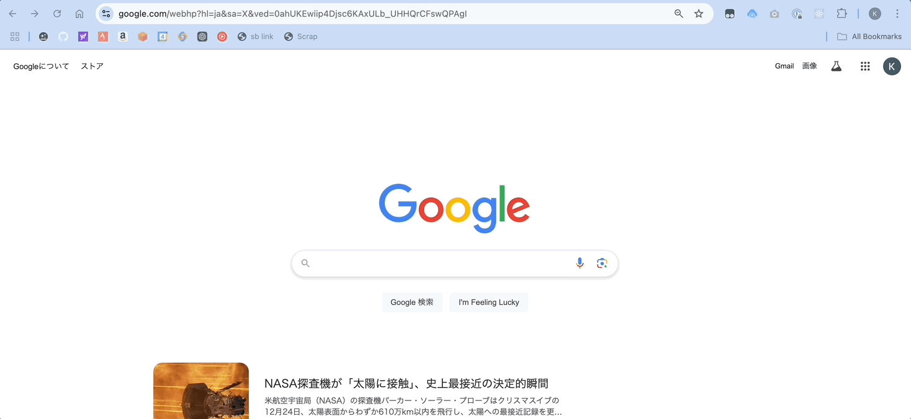
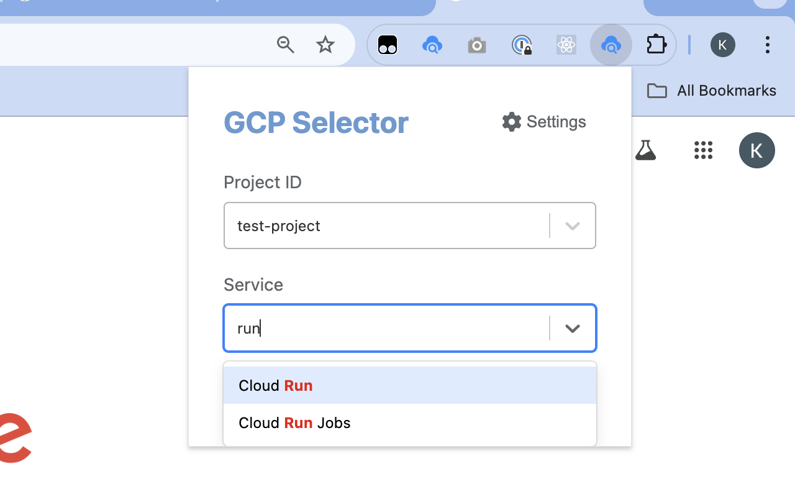
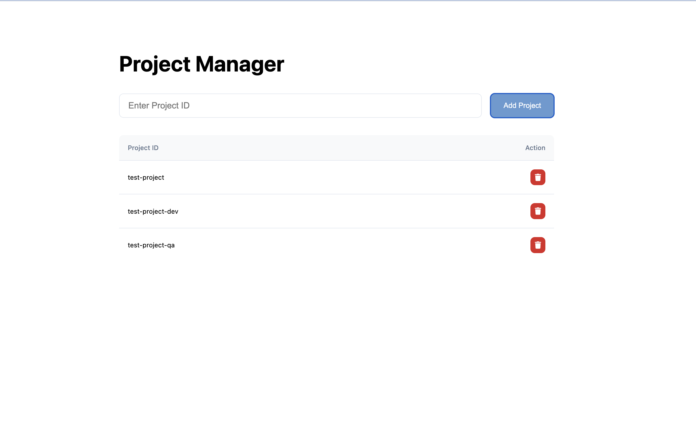

# gcp-selector

A Chrome extension that allows you to quickly select Google Cloud Platform (GCP) projects and services at once.



The list supports fuzzy search, with matching characters highlighted in red for easy identification.



project setting page



## ✨ Features
- Select both project and service simultaneously
- Register your GCP project IDs

## 📦 Installation

Install easily from the [Chrome Web Store](https://chrome.google.com/webstore/detail/gcp-selector/gdfiojnnhlfmkbghihllimpaanldflag)


## 🏗️ Project Structure

### 🔧 Architecture
This project is a Chrome extension built with React + TypeScript.

### 📁 Directory Structure
```
├── manifest.json          # Chrome extension manifest
├── package.json           # Project dependencies
├── tsconfig.json          # TypeScript configuration
├── webpack.config.js      # Webpack configuration
├── jest.config.js         # Jest configuration
├── playwright.config.ts   # Playwright configuration
│
├── e2e/                   # E2E tests (Playwright)
│   ├── fixtures.ts        # Custom fixtures for extension loading
│   ├── popup.spec.ts      # Popup tests
│   ├── option.spec.ts     # Option page tests
│   └── integration.spec.ts # Cross-page integration tests
│
├── src/                   # Source code
│   ├── popup/             # Popup screen
│   │   ├── Popup.tsx      # Main popup component
│   │   ├── popup.html     # Popup HTML
│   │   └── index.tsx      # Popup entry point
│   │
│   ├── option/            # Settings screen
│   │   ├── Option.tsx     # Settings component
│   │   ├── option.html    # Settings HTML
│   │   └── index.tsx      # Settings entry point
│   │
│   ├── components/        # Reusable components
│   │   ├── popup/         # Popup-specific components
│   │   │   ├── PopupHeader.tsx        # Header component
│   │   │   ├── ProjectSelector.tsx    # Project selection component
│   │   │   ├── ServiceSelector.tsx    # Service selection component
│   │   │   └── NoProjectsMessage.tsx  # No projects message
│   │   └── select/        # Select-related components
│   │       └── Option.tsx # Custom option component
│   │
│   ├── hooks/             # Custom hooks
│   │   ├── useNavigation.ts  # Navigation management
│   │   ├── useOptions.ts     # Settings management
│   │   └── useProjects.ts    # Project management
│   │
│   ├── utils/             # Utility functions
│   │   ├── projects/      # Project-related utilities
│   │   │   ├── AddProject.ts     # Add project
│   │   │   ├── DeleteProject.ts  # Delete project
│   │   │   ├── ListProject.ts    # List projects
│   │   │   └── Constant.ts       # Constants
│   │   └── services/      # Service-related utilities
│   │       └── ListServices.ts   # List services
│   │
│   └── types/             # Type definitions
│       ├── SelectOption.ts    # Select option types
│       └── Service.ts         # Service types
│
├── public/                # Public assets
├── dist/                  # Build output
├── icons/                 # Icon files
└── image/                 # Documentation images
```

### 🛠️ Technology Stack
- **Framework**: React 19.0.0
- **Language**: TypeScript
- **UI**: react-select, FontAwesome
- **Build Tool**: Webpack
- **Testing**: Jest, React Testing Library, Playwright
- **Package Manager**: npm

### 🚀 Key Features
- Simultaneous GCP project and service selection
- Fuzzy search support
- Seamless Chrome extension integration
- Local storage for project management

## 💻 Development

### 🔥 Hot Reload Development
For efficient development, use the hot reload feature:

```bash
npm run dev
```

This command starts webpack in watch mode, automatically rebuilding when files change.

### 🔌 Loading the Extension
1. Navigate to `chrome://extensions/`
2. Enable "Developer mode" (toggle in top right)
3. Click "Load unpacked" and select the `dist` folder
4. The extension icon will appear in your Chrome toolbar

## 🧪 Testing

### Unit Tests

```bash
npm test
```

### E2E Tests (Playwright)

E2E tests run against the actual built extension in a real Chromium browser.

```bash
npm run test:e2e        # Build and run all E2E tests
npm run test:e2e:ui     # Run with Playwright UI mode
```

The E2E suite covers:
- **Popup**: auto-focus, keyboard navigation, URL generation, settings navigation
- **Option page**: add/delete projects, validation, Enter key support
- **Integration**: cross-page storage consistency, full setup flow

## 🚀 Release

When a version tag is pushed, CI automatically runs tests, builds `gcp-selector.zip`, and attaches it to the GitHub Release.

### Version numbering

This project follows [Semantic Versioning](https://semver.org/):

| Change type | Example |
|---|---|
| Bug fix | `1.0.0` → `1.0.1` |
| New feature | `1.0.0` → `1.1.0` |
| Breaking change | `1.0.0` → `2.0.0` |

> **Note:** `manifest.json` uses `major.minor.patch` (e.g. `1.0.1`), while the Chrome Web Store only shows `major.minor`.

### Release steps

#### 1. Update versions

Edit the version field in both files:

**`manifest.json`**
```json
{
  "version": "1.0.1"
}
```

**`package.json`**
```json
{
  "version": "1.0.1"
}
```

#### 2. Commit and push to `main`

```bash
git add manifest.json package.json
git commit -m "chore: bump version to 1.0.1"
git push origin main
```

#### 3. Create a GitHub Release

1. Open the repository on GitHub and go to **Releases → Draft a new release**
2. Click **"Choose a tag"** → type the new version (e.g. `v1.0.1`) → **"+ Create new tag"**
3. Make sure the target is **`main`**
4. Fill in the release title (e.g. `v1.0.1`) and write release notes
5. Click **"Publish release"**

This publishes the tag, which triggers the CI release workflow.

#### 4. Wait for CI to attach the zip

Go to **Actions** and wait for the **Release** workflow to complete (about 1–2 minutes). Once done, `gcp-selector.zip` will be attached to the release automatically.

#### 5. Upload to Chrome Web Store

1. Download `gcp-selector.zip` from the [GitHub Release](../../releases)
2. Open the [Chrome Web Store Developer Dashboard](https://chrome.google.com/webstore/devconsole)
3. Select **GCP Selector** → **Package** → **Upload new package**
4. Upload the zip and submit for review

## 📋 Requirements
- Google Chrome browser
- Account with access to GCP console
